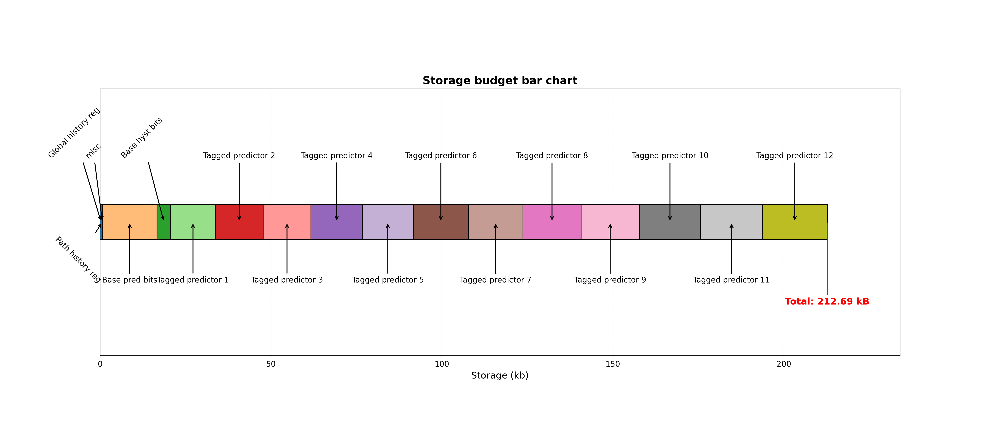
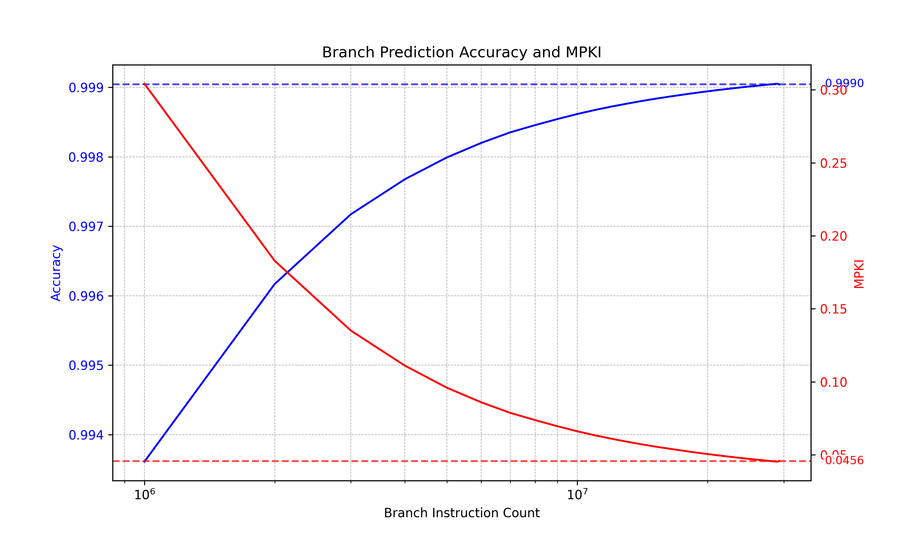
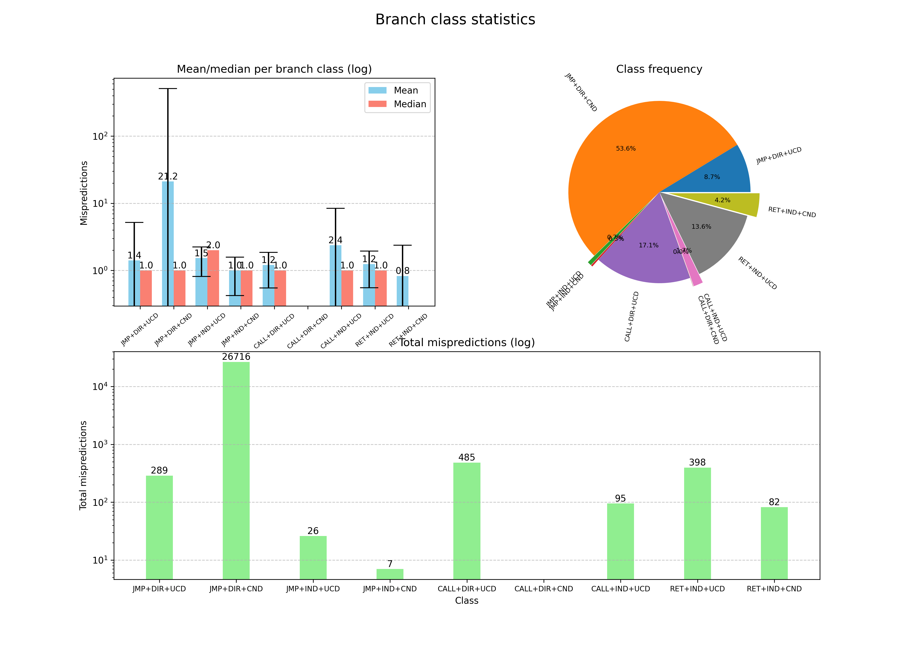
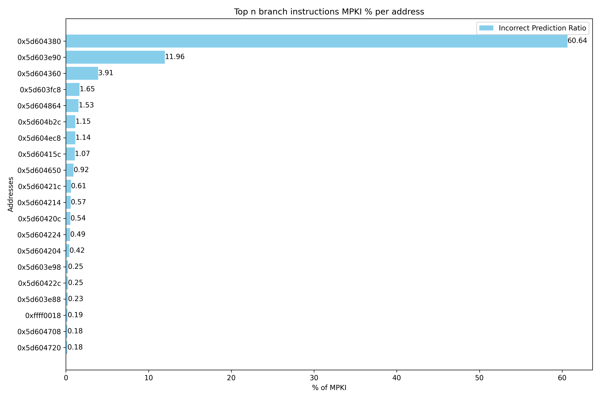
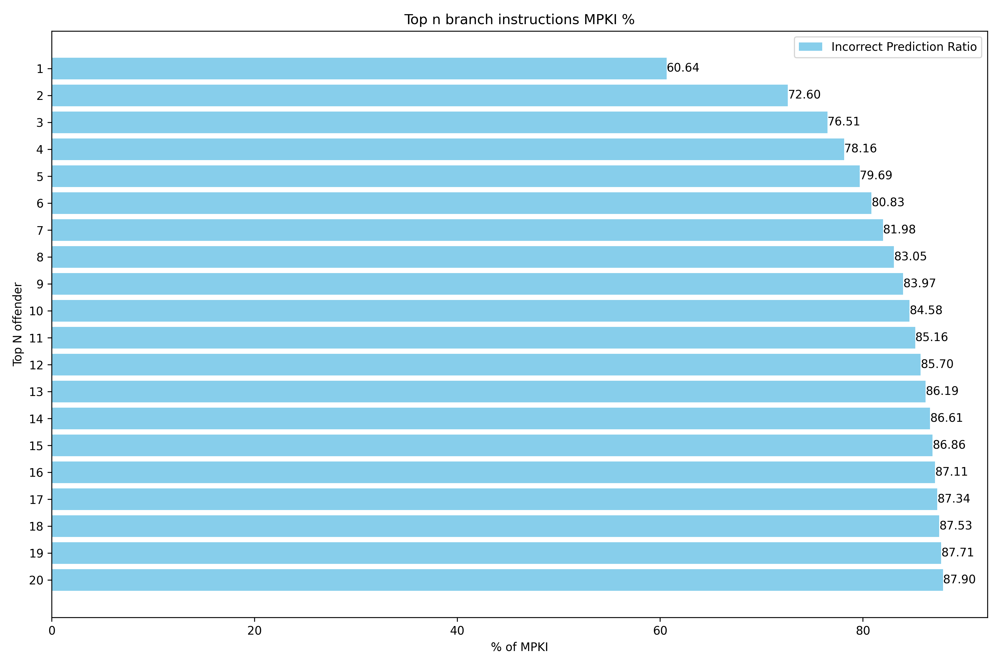

# TAGEbuilder

TAGEbuilder is a Python-based simulator and performance evaluation tool for TAGE-like branch predictors. It offers configurable parameters for modeling TAGE predictors and is optimized for performance with Numba and NumPy. Predictor performance can be evaluated with 200+ branch trace datasets from the 2016 Championship Branch Prediction (CBP2016) environment and generates detailed performance metrics.

## Features

- **Customizable Predictor Model:**  
  Configure aspects such as tagged components (number, history length, tag width) and base predictor settings (prediction bits, hysteresis bits) via a YAML spec file. A predictor with 12 tagged components with total space of 212Kb scored 95%> and 1~3 MPKI for most traces.

- **Optimized Simulation:**  
  Uses Numba JIT and NumPy vectorized operations to process ~700,000 branch sequences per second per simulation process.

- **Batch Processing:**  
  Supports batch prediction and updates for efficient data flow.

- **Real-World Trace Integration:**  
  Works with BT9-formatted branch trace files from CBP2016, reverse-engineered to meet the tool’s requirements.

- **Comprehensive Evaluations:**  
  Generates metrics and visualizations including MPKI, accuracy graphs, memory usage charts, misprediction statistics, branch class analysis, and CSV outputs for further analysis.

- **Parallel Processing:**  
  Runs multiple traces in parallel processes to speed up evaluations.

## Project directory

```
Directory structure:
└── wonjongbot-tagebuilder/
    ├── README.md
    ├── LICENSE
    ├── requirements.txt
    ├── setup.py
    ├── test_plot.py
    ├── bin/
    │   ├── __init__.py
    │   ├── run_test.py
    │   └── run_test_bt9.py-----------> **main script to run the tool**
    ├── configs/
    │   ├── sim_list.yaml-------------> **list of traces to run**
    │   ├── bimodal.yaml
    │   ├── tage_l.yaml
    │   └── tage_sc_l.yaml
    ├── docs/
    │   ├── example_sim_output.tar.gz
    │   ├── note.md
    │   └── img/
    ├── reports/
    │   └── sim_run_<timestamp>-------> **folders for each sim job**
    ├── scripts/
    │   └── clean_dir.sh
    └── tagebuilder_core/
        ├── __init__.py
        ├── bt9reader.py--------------> **BT9 formatted trace file reader**
        ├── helpers.py----------------> **helper functions for plotting and more**
        ├── plot_gen.py---------------> **plotting functions**
        ├── settings.py---------------> **directories for simulation traces and results**
        └── tage_optimized.py---------> **tage predictor model logic**

```

## Installation / Initial setup

1) Clone the repo

2) `cd tageBuilder`

3) `pip install -r requirements.txt` to resolve dependencies

4) `python setup.py` to automatically setup tool directories

> uncomment trace download portion of the script in `setup.py` to download the traces as well. Or else download manually from [this google drive link](https://drive.google.com/drive/folders/1VAdmqdOEFLvnRKkQQidxvGJA_C6S2RWo?usp=sharing) (Source: [craymichael/CBP-16-Simulation](https://github.com/craymichael/CBP-16-Simulation)). Make sure to update `extracted_dir` variable in `tagebuilder_core/settings.py`

## Usage

After setup, run the command below while still in tool root directory

`~/tageBuilder $ <python_env> -m bin.run_test_bt9 --spec <spec_name> --sim_list <sim_list_path>`

`<python_env>`: your favorite python environment (tested on python >3.11)

`<spec_name>`: name of the predictor spec within `configs/` directory (exclude .yaml)

`<sim_list_path>`: path to yaml config file that lists list of traces to simulate

The simulation will start, and all simulation runs will be stored at

`reports/sim_run_<timestamp>` where results from each trace are stored individually. 


## Configuration

TAGEbuilder uses a YAML configuration file to define predictor parameters. This allows users to easily adjust the following:
- Number and configuration of tagged components
- Base predictor settings (e.g., prediction bits, hysteresis bits)
- Global predictor parameters (e.g., path history length, usefulness bit duration)

Below is an example predictor spec with one base bimodal predictor and 4 tagged predictors.

```yaml
global_config:
    phist_len: 16
    u_duration_log: 19
tables:
    - name: base
      isBase: true
      hist_len: 0
      num_pred_entries_log: 14
      num_hyst_entries_log: 12
      tag_width: 0

    - name: t1
      isBase: false
      hist_len: 8
      num_pred_entries_log: 10
      num_hyst_entries_log: 0
      tag_width: 8

    - name: t2
      isBase: false
      hist_len: 12
      num_pred_entries_log: 10
      num_hyst_entries_log: 0
      tag_width: 9

    - name: t3
      isBase: false
      hist_len: 18
      num_pred_entries_log: 10
      num_hyst_entries_log: 0
      tag_width: 9

    - name: t4
      isBase: false
      hist_len: 27
      num_pred_entries_log: 10
      num_hyst_entries_log: 0
      tag_width: 10

```

## Data Input

The tool accepts branch trace files in the BT9 format, compatible with the CBP2016 traces. 

> check 4) in Installation / Initial setup for downloading the dataset. 


## Output

> check `docs/example_sim_output.tar.gz` for output example.

TAGEbuilder produces several outputs:
- Visualizations for memory usage by predictor components

<p align="center">
    
</p>

- Graphs for MPKI and accuracy

<p align="center">
    
</p>

- Statistics on mispredictions per branch PC and branch class analysis

<p align="center">
    
</p>

<p align="center">
    
</p>

<p align="center">
    
</p>
- CSV files summarizing simulation results (per predictor, per branch PC address, general MPKI/accuracy)

## Future Plans

- [ ] Clean up code (remove unoptimized reader and predictor code)
- [ ] Additional visualizations (e.g., transition count vs. accuracy heatmap)
- [ ] Enhanced misprediction confidence metrics
- [ ] HTML report generation for easier navigation and more interactive analysis experience

## Contributing

Always open for helping hands! If anyone have ideas for improvements, please do a pull request or contact me.

## License

Copyright 2024 Wonjong "Peter" Lee

Permission is hereby granted, free of charge, to any person obtaining a copy of this software and associated documentation files (the “Software”), to deal in the Software without restriction, including without limitation the rights to use, copy, modify, merge, publish, distribute, sublicense, and/or sell copies of the Software, and to permit persons to whom the Software is furnished to do so, subject to the following conditions:

The above copyright notice and this permission notice shall be included in all copies or substantial portions of the Software.

THE SOFTWARE IS PROVIDED “AS IS”, WITHOUT WARRANTY OF ANY KIND, EXPRESS OR IMPLIED, INCLUDING BUT NOT LIMITED TO THE WARRANTIES OF MERCHANTABILITY, FITNESS FOR A PARTICULAR PURPOSE AND NONINFRINGEMENT. IN NO EVENT SHALL THE AUTHORS OR COPYRIGHT HOLDERS BE LIABLE FOR ANY CLAIM, DAMAGES OR OTHER LIABILITY, WHETHER IN AN ACTION OF CONTRACT, TORT OR OTHERWISE, ARISING FROM, OUT OF OR IN CONNECTION WITH THE SOFTWARE OR THE USE OR OTHER DEALINGS IN THE SOFTWARE.
